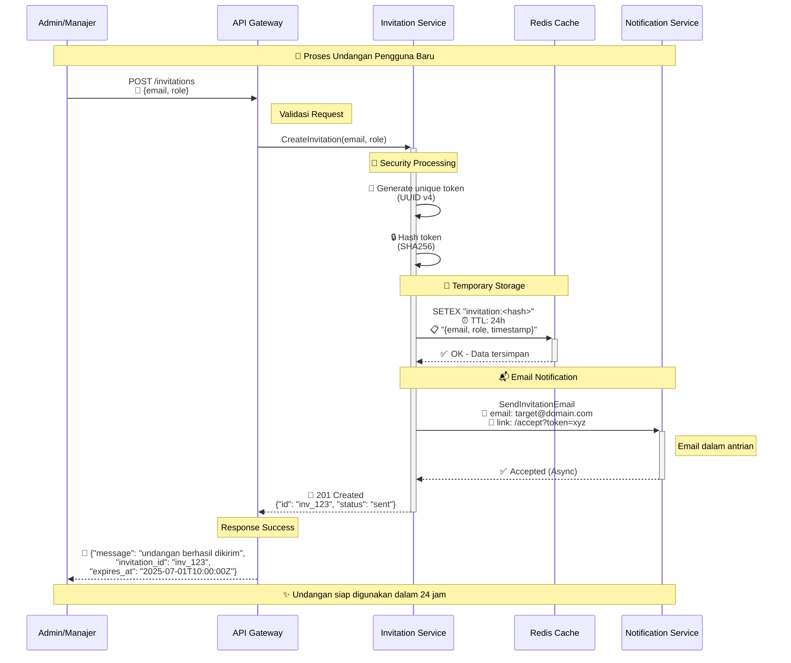

# 💌 Prism Invitation Service <a href="https://github.com/Lumina-Enterprise-Solutions/prism-invitation-service/releases"></a> <a href="https://github.com/Lumina-Enterprise-Solutions/prism-invitation-service/actions/workflows/ci.yml"></a>

**Prism Invitation Service** adalah microservice yang bertanggung jawab untuk mengelola seluruh siklus hidup undangan pengguna di ekosistem Prism ERP. Layanan ini menangani pembuatan token undangan yang aman, pengiriman notifikasi, dan validasi token sekali pakai.

---

## 🏗️ Arsitektur & Alur Kerja

Layanan ini beroperasi sebagai komponen stateful yang ringan, mengandalkan Redis untuk persistensi sementara dan berinteraksi dengan layanan lain untuk fungsionalitas penuh.

### Tanggung Jawab Utama:
-   **Membuat Undangan**: Menerima permintaan untuk mengundang pengguna baru dengan email dan peran tertentu.
-   **Menghasilkan Token Aman**: Membuat token unik yang tidak dapat diprediksi untuk setiap undangan.
-   **Penyimpanan Sementara**: Menyimpan *hash* dari token beserta data undangan (email, peran) di **Redis** dengan Time-To-Live (TTL) yang dapat dikonfigurasi.
-   **Memberi Notifikasi**: Berkomunikasi dengan **Prism Notification Service** untuk mengirim email undangan kepada pengguna.
-   **Memvalidasi Token**: Menyediakan endpoint internal yang aman bagi **Prism Auth Service** untuk memverifikasi validitas token dan mengambil data undangan. Token akan dihapus setelah berhasil divalidasi.

### Alur Kerja Pembuatan Undangan



---

## 🔌 API Endpoints

Layanan ini mengekspos dua endpoint utama yang dirutekan melalui API Gateway.

| Method | Path                      | Deskripsi                                                                 | Body Permintaan (Request)              |
| :----- | :------------------------ | :------------------------------------------------------------------------ | :------------------------------------- |
| `POST` | `/invitations`            | Membuat undangan baru dan mengirimkannya melalui email.                   | `{"email": "string", "role": "string"}` |
| `POST` | `/invitations/validate`   | **(Internal)** Memvalidasi token undangan dan mengembalikan data terkait. | `{"token": "string"}`                  |

---

## ⚙️ Konfigurasi

Konfigurasi layanan dimuat dari **Consul** saat startup, dengan rahasia diambil dari **Vault**.

-   **Variabel Lingkungan yang Dibutuhkan**:
    -   `VAULT_ADDR`: Alamat instance HashiCorp Vault.
    -   `VAULT_TOKEN`: Token untuk otentikasi dengan Vault.

-   **Konfigurasi dari Consul** (di bawah path `config/prism-invitation-service/`):
    -   `port`: Port server HTTP (default: `8080`).
    -   `invitation_ttl_hours`: Masa berlaku token undangan dalam jam (default: `168` / 7 hari).

-   **Konfigurasi Global dari Consul**:
    -   `config/global/jaeger_endpoint`: Alamat untuk Jaeger (tracing).
    -   `config/global/redis_addr`: Alamat instance Redis.

---

## 🚀 Menjalankan & Menguji Layanan

### Menjalankan dalam Ekosistem Lengkap (Disarankan)

Cara terbaik untuk menjalankan layanan ini adalah sebagai bagian dari tumpukan infrastruktur Prism yang lengkap.

1.  Pastikan Anda berada di direktori `infra` dari monorepo.
2.  Jalankan perintah berikut:
    ```bash
    make local-up
    ```
    Ini akan membangun dan menjalankan semua layanan, termasuk `prism-invitation-service`, dengan semua dependensi yang diperlukan.

### Menjalankan Secara Mandiri (Untuk Pengujian Terisolasi)

Anda dapat menjalankan layanan ini secara terpisah menggunakan Makefile lokalnya.

```bash
# Menginstal dependensi
go mod tidy

# Menjalankan unit tests
make test

# Menjalankan linter untuk memeriksa kualitas kode
make lint

# Membangun binary aplikasi
make build

# Menjalankan aplikasi (membutuhkan Redis yang berjalan)
make run
```

---

## 🔄 Alur Kerja Kontribusi (Git Flow)

Kami menggunakan alur kerja standar yang didukung oleh `Makefile.ops` untuk menjaga konsistensi.

1.  **Sinkronkan branch Anda**:
    ```bash
    make -f Makefile.ops sync
    ```
2.  **Buat branch fitur baru**:
    ```bash
    make -f Makefile.ops feature name=deskripsi-fitur-baru
    ```
3.  **Lakukan perubahan kode Anda**.

4.  **Buat Pull Request**:
    Setelah Anda siap, dorong (push) branch Anda ke remote dan jalankan:
    ```bash
-    make -f Makefile.ops pr
+    make -f Makefile.ops pr # ATAU 'make pr' jika Makefile utama mengimpor Makefile.ops
    ```
    Perintah ini akan membuka halaman pembuatan Pull Request di browser Anda.

---

##  CI/CD Pipeline

Repositori ini dilengkapi dengan dua pipeline GitHub Actions:

-   **`ci.yml`**: Berjalan pada setiap *push* dan *pull request*. Pipeline ini melakukan:
    -   Linting kode.
    -   Menjalankan unit tests (dengan service container Redis).
    -   Membangun binary dan image Docker untuk validasi.

-   **`release.yml`**: Berjalan ketika sebuah tag `v*` (contoh: `v1.2.0`) di-push. Pipeline ini melakukan:
    -   Membangun dan mem-push image Docker ke GitHub Container Registry (GHCR).
    -   Membuat GitHub Release baru secara otomatis beserta catatan rilisnya.
